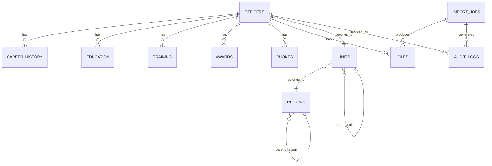

# Database Design

Conceptual table design for BPPIS. No SQL/DDL yet — this describes purpose,
key fields, and relationships only. Actual schema/migrations land in Phase 2.

## Tables

### officers
Core personnel record. One row per border patrol officer.
- Identity fields (name, badge/ID number, rank, status)
- Foreign keys to `units` and `regions`
- Source metadata (originating Drive file, import job)

### career_history
Chronological record of an officer's positions and assignments.
- References `officers`
- Position, unit, start/end dates

### education
Educational background per officer.
- References `officers`
- Institution, qualification, dates

### training
Completed training courses/certifications.
- References `officers`
- Course name, provider, completion date, expiry (if applicable)

### awards
Commendations and awards received.
- References `officers`
- Award name, date, issuing authority

### phones
Contact numbers associated with an officer.
- References `officers`
- Number, type (mobile/office/emergency), primary flag

### units
Organizational units within the border patrol.
- Name, parent unit (self-referencing for hierarchy)
- References `regions`

### regions
Geographic/administrative regions.
- Name, code, parent region (self-referencing, optional)

### files
Source and derived files (original Drive image, processed crops, documents).
- References `officers`
- Storage path, file type, checksum, source Drive file ID

### import_jobs
Tracks each import run through the pipeline.
- Status (pending, processing, validated, failed, needs_review, completed)
- Source (Drive folder/file), timestamps, error details, confidence summary

### audit_logs
Immutable log of changes to personnel data.
- Actor (user or system), action, table/record affected, before/after snapshot, timestamp

## Relationship Overview

## Open Questions (to resolve in Phase 2)

- Soft-delete strategy for `officers` (status flag vs. `deleted_at`).
- Whether `career_history` and `units` should support effective-dated history.
- Confidence score storage: per-record vs. per-field.
