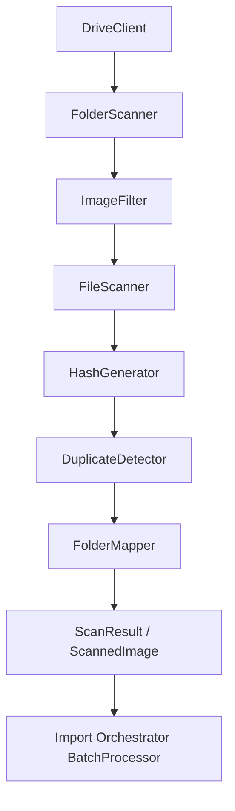
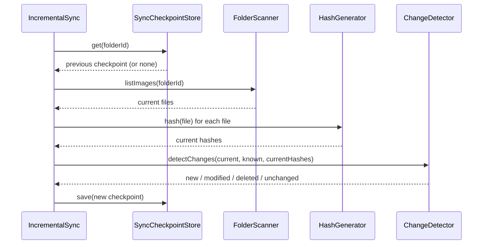

# Google Drive Architecture

Phase 4. Describes the scanning subsystem that will eventually source
personnel profile images from Google Drive. Design and TypeScript
interfaces only — **no Google SDK, no credentials, no API calls**.

## Why This Exists

The Import Orchestrator (Phase 3) accepts `ScannedImage[]` as input but has
no way to produce it from a real source. This phase builds that production
layer: folder traversal, file metadata extraction, duplicate detection,
incremental change tracking, and region/organization mapping — all against
interfaces, so the real Google Drive SDK (or a future OneDrive/SharePoint
client) can be dropped in later without touching any consumer.

## Scanning Flow



- **DriveClient** (`drive_client.ts`) — provider-agnostic contract for
  fetching folder/file metadata. `InMemoryDriveClient` is a fake for local
  development; a real implementation would wrap the `googleapis` Drive v3
  client behind this same interface.
- **FolderScanner** (`folder_scanner.ts`) — walks the folder tree
  (`scanFolder` for one level, `scanRecursive` for the full tree,
  `listImages` as a flat convenience method), delegating image filtering
  to `ImageFilter`.
- **FileScanner** (`file_scanner.ts`) — fetches and normalizes a single
  file's metadata (`id`, `name`, `mimeType`, `size`, `modifiedTime`,
  `parents`, `webViewLink`, `thumbnailLink`).
- **ImageFilter** (`image_filter.ts`) — accepts jpg/jpeg/png/webp, rejects
  pdf/doc/video/zip/etc. by MIME type (plus zero-byte and missing-extension
  checks).
- **HashGenerator** (`hash_generator.ts`) — computes a content hash
  (SHA-256 by default; MD5 as a named future extension) used for duplicate
  detection and change comparison. Stubbed in this phase since no file
  bytes are fetched yet.
- **DuplicateDetector** (`duplicate_detector.ts`) — groups files by hash,
  then filename, then filesize, in that priority order.
- **FolderMapper** (`folder_mapper.ts`) — resolves a folder id (or chain of
  ancestor folders) to an `OrganizationalUnit` (region/province/battalion/
  company).
- **ScanResult** (`scan_result.ts`) — assembles the final `ScannedImage`
  from a filtered file, its hash, and its resolved unit, and adapts it to
  the simpler shape Phase 3's `BatchProcessor` already accepts.

## Incremental Sync Strategy



`IncrementalSync` (`incremental_sync.ts`) tracks, per folder:
- **last scan** — `SyncCheckpoint.lastScannedAt`.
- **new files** — present now, absent from the prior checkpoint's known
  hashes.
- **modified files** — present in both, but with a changed hash.
- **deleted files** — present in the prior checkpoint, absent now.

`ChangeDetector` (`change_detector.ts`) does the actual comparison and is
kept separate from `IncrementalSync` so it can be unit tested against plain
data, without a DriveClient or checkpoint store involved.

On first run (no prior checkpoint for a folder), every discovered file is
reported as `new` — there is nothing to diff against yet.

## Duplicate Detection Strategy

`DuplicateDetector` groups files by:
1. **SHA-256 hash** (`detectByHash`) — authoritative when content hashes are
   available; byte-identical files are always duplicates regardless of
   name or folder.
2. **Filename** (`detectByFilename`) — case-insensitive, trimmed; used when
   hashes are not yet computed for the batch.
3. **Filesize** (`detectByFilesize`) — weakest signal, useful as a last
   resort or as a quick pre-filter before hashing large batches.

`DefaultDuplicateDetector.detectAll` runs these in priority order, using the
strongest signal that produces any groups. Within a group, the
earliest-modified file is chosen as canonical; the rest are flagged as
duplicates.

## Folder Mapping Examples

`FolderMapper` resolves an `OrganizationalUnit` from a folder id or a chain
of ancestor folders (closest ancestor wins). Example configuration for the
four Border Patrol regions, each with nested province/battalion/company
folders:

```ts
const mapper = new ConfigFolderMapper([
  { folderId: "region-north-root", unit: { region: "North" } },
  { folderId: "region-north-prov-a", unit: { region: "North", province: "Province A" } },
  { folderId: "region-north-prov-a-bn-1", unit: { region: "North", province: "Province A", battalion: "Battalion 1" } },
  { folderId: "region-north-prov-a-bn-1-co-2", unit: {
      region: "North", province: "Province A", battalion: "Battalion 1", company: "Company 2",
    } },
  { folderId: "region-south-root", unit: { region: "South" } },
  { folderId: "region-east-root", unit: { region: "East" } },
  { folderId: "region-west-root", unit: { region: "West" } },
]);
```

A file whose direct parent folder is `region-north-prov-a-bn-1-co-2`
resolves to the fully-specified unit; a file directly under
`region-south-root` resolves to just `{ region: "South" }`. Configuration is
plain data (`FolderMappingEntry[]`), so it can later be sourced from a
config file, environment variable, or database table without changing
`ConfigFolderMapper`'s interface.

## Future Webhook Integration

Google Drive supports push notifications (`files.watch`) that call a
webhook when changes occur in a watched folder, instead of polling on a
schedule. This phase does not implement any webhook receiver, but the
architecture anticipates it:

- `DriveClient.getStartPageToken` mirrors the Drive API's
  `changes.getStartPageToken`, giving a future webhook handler a stable
  starting point for `changes.list` calls.
- A future webhook receiver would translate an incoming Drive change
  notification into a call to `IncrementalSync.sync(folderId)` (or a more
  targeted "sync just this changed file" variant), reusing all of
  `ChangeDetector`, `HashGenerator`, `DuplicateDetector`, and
  `FolderMapper` unchanged.
- No public endpoint, verification token handling, or subscription renewal
  logic exists yet — that is entirely out of scope until a real API
  integration phase.

## Future Providers

Every interface in this layer (`DriveClient`, `FolderScannerEngine`,
`FileScannerEngine`, `HashGenerator`, `DuplicateDetectorEngine`,
`FolderMapperEngine`, `ChangeDetectorEngine`) is named and shaped to avoid
Google-specific concepts in its method signatures, so a future OneDrive or
SharePoint scanner can implement the same contracts and plug into
`FolderScanner`, `IncrementalSync`, etc. without changes to this layer's
internals.
