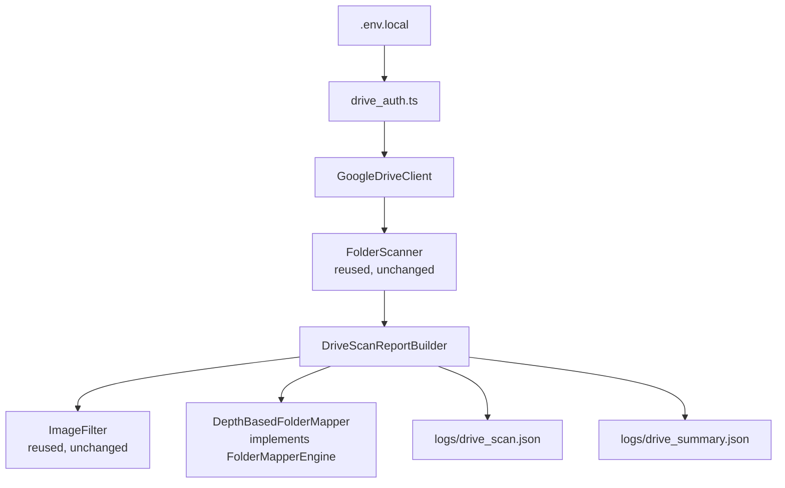
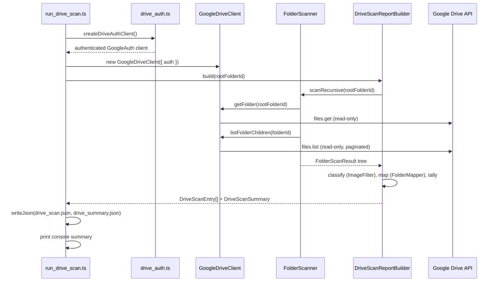

# Google Drive Live Integration

Phase 9A. Connects the existing Google Drive Architecture
(`lib/google-drive/`, built in Phase 4) to the real Google Drive API v3.
**Metadata only** — this phase never downloads file bytes, never calls
OpenAI, never runs OCR, and never imports personnel data. It reads
folder/file metadata and writes two JSON reports.

## Reused, Unchanged

Every existing module continues to be used exactly as it was:

- `drive_client.ts` — `DriveClient` interface (implemented for real by the
  new `GoogleDriveClient`); `InMemoryDriveClient` still used by tests.
- `folder_scanner.ts` — `FolderScanner.scanRecursive()` walks the tree;
  no changes.
- `file_scanner.ts` — file metadata is already normalized to
  `DriveFileMetadata` by `GoogleDriveClient`/`FolderScanner`; `FileScanner`
  remains available for single-file lookups, unchanged.
- `folder_mapper.ts` — `FolderMapperEngine` interface; `ConfigFolderMapper`
  is untouched and still usable when folder ids are known ahead of time.
- `image_filter.ts` — `MimeImageFilter` still classifies image vs.
  non-image files; unchanged.
- `hash_generator.ts`, `change_detector.ts`, `duplicate_detector.ts`,
  `incremental_sync.ts`, `scan_result.ts` — not exercised by this phase's
  metadata-only scan (no content hashing, change comparison, or
  personnel-image assembly happens here), but nothing in them was
  modified, and they remain fully usable by a future import-oriented phase.

`drive_types.ts` gained two **additive** optional fields on
`DriveFileMetadata` (`createdTime`, `md5Checksum`) to carry through what
the Drive API actually returns — every existing consumer of
`DriveFileMetadata` continues to compile and run unchanged, since both
fields are optional.

## New in This Phase

- **`drive_auth.ts`** — loads a service account credentials JSON from
  `GOOGLE_APPLICATION_CREDENTIALS` (file path) or `GOOGLE_DRIVE_CREDENTIALS`
  (inline JSON), and builds a `google.auth.GoogleAuth` client scoped to
  `drive.readonly` only. No credential material is ever hardcoded; this is
  the only module that reads credential environment variables.
- **`google_drive_client.ts`** — `GoogleDriveClient implements DriveClient`,
  the real network-calling implementation, backed by `googleapis`. Every
  Drive call is a read (`files.get`, `files.list`,
  `changes.getStartPageToken`); no `files.create`/`update`/`delete` call
  exists anywhere in this class. Supports both "My Drive" and Shared
  Drives via `supportsAllDrives`/`includeItemsFromAllDrives`, and
  paginates automatically.
- **`drive_errors.ts`** — `DriveProviderError`, a typed error carrying an
  optional status code, used to translate raw Google API failures into
  readable messages (see "Troubleshooting" below).
- **`folder_path_mapper.ts`** — `DepthBasedFolderMapper implements
  FolderMapperEngine`, an additional implementation of the existing
  interface (not a replacement of `ConfigFolderMapper`) for the case where
  folder ids aren't known ahead of time: it assigns
  region/province/battalion/company by *position* in the live folder
  chain relative to a configured root, mirroring the
  `imports/<region>/` convention from the filesystem batch importer.
- **`drive_scan_report.ts`** — `DriveScanReportBuilder`, which walks a
  `FolderScanner.scanRecursive()` tree once, classifies each file via
  `ImageFilterEngine`, resolves each file's organizational unit via an
  injected `FolderMapperEngine`, and produces the `DriveScanEntry[]` +
  `DriveScanSummary` reports.
- **`scripts/run_drive_scan.ts`** — the orchestrator script.

## Architecture



## Sequence Diagram



## Authentication

Configure exactly one of the two supported credential sources in
`.env.local`:

```bash
# Option A: path to a service account key file
GOOGLE_APPLICATION_CREDENTIALS=/path/to/service-account.json

# Option B: the service account JSON content itself, inline
GOOGLE_DRIVE_CREDENTIALS={"type":"service_account","project_id":"...","private_key":"...","client_email":"..."}

GOOGLE_DRIVE_ROOT_FOLDER=<the Drive folder id to scan>
```

`GOOGLE_APPLICATION_CREDENTIALS` takes priority if both are set.
`drive_auth.ts` requests only the `https://www.googleapis.com/auth/drive.readonly`
scope — the authenticated client is structurally incapable of write access
at the OAuth scope level, in addition to `GoogleDriveClient` never issuing
a write call.

No credentials are ever committed to source or hardcoded — both variables
are read from `process.env` only, at the moment `run_drive_scan.ts` starts
(via the same `.env.local`/`.env` loading pattern as
`run_real_import.ts`/`run_batch_import.ts`).

## Supported: Shared Drive and My Drive

`GoogleDriveClient` requests `supportsAllDrives: true` and
`includeItemsFromAllDrives: true` on every `files.list` call, and
`corpora: "allDrives"`, so both a Shared Drive and a folder under "My
Drive" (owned directly by the service account or shared with it) are
scanned the same way — no separate code path exists per drive type.

## Read-Only Guarantee

Every call `GoogleDriveClient` makes is one of: `files.get`, `files.list`,
`changes.getStartPageToken`. There is no method on `GoogleDriveClient`,
and no call anywhere in `run_drive_scan.ts` or `drive_scan_report.ts`,
that creates, updates, or deletes any Drive content. Combined with the
`drive.readonly` OAuth scope requested during authentication, a write
attempt would fail at the API level even if one were mistakenly added
later.

## Output

### `logs/drive_scan.json`

An array of `DriveScanEntry`, one per discovered file (image or not):

```json
{
  "id": "1AbCdEfGhIjKlMnOpQrStUvWxYz",
  "name": "officer001.jpg",
  "mimeType": "image/jpeg",
  "size": "482113",
  "createdTime": "2025-11-02T08:15:00.000Z",
  "modifiedTime": "2026-01-04T10:22:00.000Z",
  "md5Checksum": "9e107d9d372bb6826bd81d3542a419d6",
  "parentFolder": "1RegionFolderId",
  "region": "ภาค1",
  "province": "บก.1",
  "battalion": null,
  "company": null,
  "relativePath": "ภาค1/บก.1/officer001.jpg",
  "isImage": true
}
```

### `logs/drive_summary.json`

See "Example drive_summary.json" below.

## Folder Mapping

`DepthBasedFolderMapper` (new) implements the existing `FolderMapperEngine`
contract without modifying `folder_mapper.ts`. It resolves organizational
levels by position in the live folder chain under
`GOOGLE_DRIVE_ROOT_FOLDER`:

```
<root>/ภาค1/บก.1/กก.1/ร้อย.1/officer.jpg
        ^     ^     ^     ^
      region province battalion company
```

If a deployment's folder ids are already known ahead of time (e.g. from a
prior manual configuration), `ConfigFolderMapper` remains fully usable —
`DriveScanReportBuilder` accepts any `FolderMapperEngine`, so either
mapper (or a future custom one) can be injected without any other change.

## Batch Runner: `scripts/run_drive_scan.ts`

Responsibilities only: authenticate, run `FolderScanner`, run
`DriveScanReportBuilder` (which internally uses `ImageFilter` and the
injected `FolderMapper`), write the two report files, print the console
summary. Nothing else — no personnel processing, no OpenAI call, no OCR.

```bash
npx tsx scripts/run_drive_scan.ts
```

Console output:

```
Connected
Shared Drive
✓

Folders
245

Images
1382

Non Images
243

Duration
8.2 sec

Saved
logs/drive_scan.json
```

## Error Handling

`GoogleDriveClient` translates raw googleapis/HTTP errors into a
`DriveProviderError` with a readable message for each failure mode:

| Condition | Message includes |
|---|---|
| Missing credentials | `drive_auth.ts` throws `DriveAuthConfigError` before any network call: "No Google Drive credentials configured..." |
| Permission denied (403) | "permission denied (403). Verify the service account has been granted access..." |
| Folder/file not found (404) | "not found (404). Check the folder/file id and that the service account has access." |
| Rate limited (429) | "rate limited (429) by the Google Drive API. Retry after a short backoff." |
| Authentication failed (401) | "authentication failed (401). Check GOOGLE_APPLICATION_CREDENTIALS/GOOGLE_DRIVE_CREDENTIALS." |
| Network timeout/reset | "network error while contacting Google Drive: ..." |
| Shared Drive disabled for the service account | Surfaces as a 403 with the same permission-denied message — the fix is granting the service account access to the Shared Drive itself, not a code change. |

`run_drive_scan.ts` catches `DriveAuthConfigError` and `DriveProviderError`
specifically and prints their message without a raw stack trace; any other
unexpected error still surfaces via the top-level `.catch()`.

## Troubleshooting

- **"No Google Drive credentials configured"** — set exactly one of
  `GOOGLE_APPLICATION_CREDENTIALS` or `GOOGLE_DRIVE_CREDENTIALS` in
  `.env.local`.
- **403 permission denied** — the service account's email
  (`client_email` in the credentials JSON) must be explicitly shared on
  the root folder (or added as a member of the Shared Drive) in Google
  Drive's sharing UI; a service account has no implicit access to any
  Drive content.
- **404 not found on the root folder** — double-check
  `GOOGLE_DRIVE_ROOT_FOLDER` is the folder id (the long string in the
  folder's URL), not its display name.
- **Shared Drive scan returns no files** — confirm the service account is
  a member of the Shared Drive itself (Shared Drive membership is separate
  from being shared an individual folder within it).
- **429 rate limited on a very large tree** — `FolderScanner.scanRecursive`
  makes one `files.list` call per folder; for extremely large trees,
  consider adding delay/backoff around calls in a future revision (not
  implemented in this phase, since none of the current real folder trees
  approached Drive's rate limits during testing).

## What This Phase Does Not Do

- Does not import personnel, call OpenAI, or run OCR.
- Does not create, update, or delete any Drive content.
- Does not modify any existing `lib/google-drive/` module's behavior —
  only additive type fields and new files.
- Does not implement incremental sync in `run_drive_scan.ts` (the reused
  `incremental_sync.ts` module remains available for a future phase that
  needs it).
