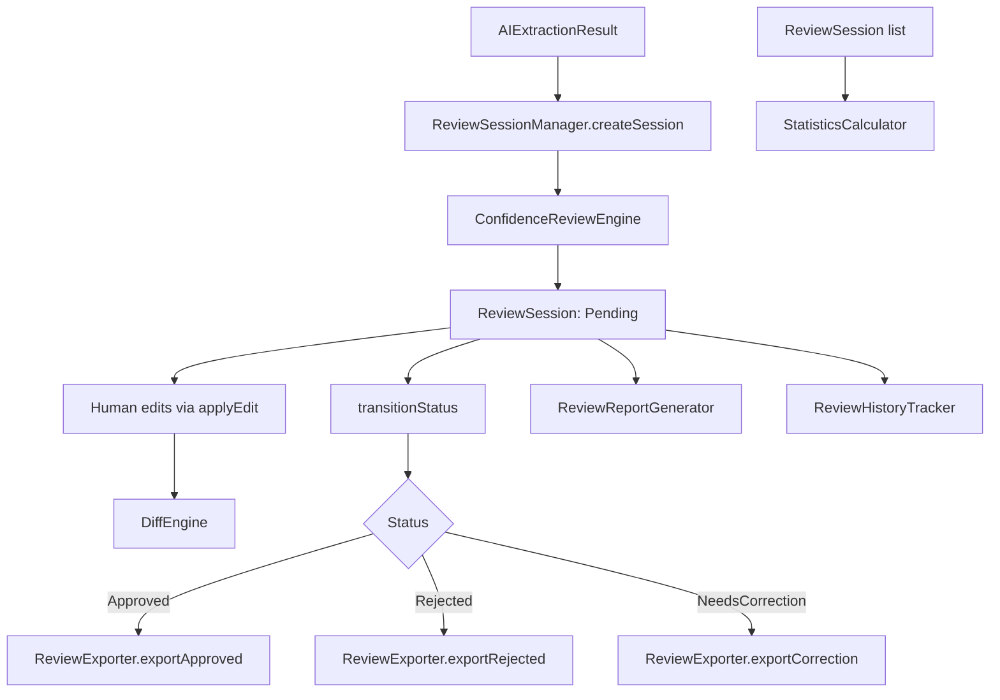
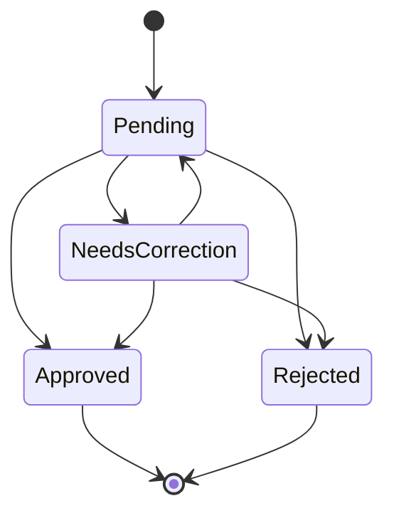

# Human Review Layer

Phase 8. Every AI extraction (Phase 7's `personnel_result.json` shape) must
pass through human review before it is ever persisted. This layer models
that review workflow — no database, no website, no dashboard, no API.

## Why This Exists

Phase 7 proved the pipeline produces real structured JSON from a real
image via a real Vision model. But AI extraction is fallible: fields can be
missed, misread, or extracted with low confidence. Nothing should be
written to a permanent store (a future phase) without a human explicitly
approving, rejecting, or correcting it first. This layer is that gate.

## Architecture

- **review_types.ts** — shared interfaces: `AIExtractionResult` (the Phase 7
  input shape), `ReviewSession`, `ReviewStatus`, `DiffResult`,
  `ConfidenceConcern`, `ReviewHistoryEntry`, `ReviewPackage`,
  `ReviewStatistics`.
- **review_status.ts** — `canTransitionReviewStatus` /
  `isTerminalReviewStatus`: the status state machine.
- **review_session.ts** — `ReviewSessionManager`: creates sessions from AI
  results, applies human edits, transitions status. Composes the other
  engines via constructor injection (SOLID: single responsibility per
  collaborator).
- **review_diff.ts** — `DiffEngine` / `DefaultDiffEngine`: field-by-field
  comparison producing added/removed/changed results, including
  index-based timeline entry comparison.
- **review_confidence.ts** — `ConfidenceReviewEngine` /
  `DefaultConfidenceReviewEngine`: surfaces low overall/field confidence,
  timeline uncertainty, missing phone, missing unit.
- **review_report.ts** — `ReportGenerator` / `MarkdownReportGenerator`:
  renders a session + diff into a readable markdown summary.
- **review_export.ts** — `ReviewExporter` / `DefaultReviewExporter`: shapes
  approved/rejected/correction JSON payloads (status-guarded — exporting
  the wrong shape for the session's actual status throws).
- **review_history.ts** — `ReviewHistoryTracker` /
  `DefaultReviewHistoryTracker`: appends immutable audit entries
  (reviewer, timestamp, action, changes).
- **review_statistics.ts** — `StatisticsCalculator` /
  `DefaultStatisticsCalculator`: approval/rejection/correction rate and
  average confidence across a set of sessions.

## Review Status Workflow

`Approved` and `Rejected` are terminal. `NeedsCorrection` allows looping
back to `Pending` (e.g. after a correction is made, for a second reviewer
to re-approve) or moving directly to `Approved`/`Rejected` once resolved.
`ReviewSessionManager.transitionStatus` throws on any transition not shown
above, matching the fail-loudly pattern used for `ImportJob` in Phase 3.

## Diff Engine

`DefaultDiffEngine.diff(original, edited)` compares every scalar field
(`rank`, `first_name`, `last_name`, `position`, `unit`, `phone`, `notes`)
and the `timeline` array (index-based comparison), returning:
- `added` — timeline entries present in `edited` but not `original`.
- `removed` — timeline entries present in `original` but not `edited`.
- `changed` — scalar fields or timeline entries whose values differ.
- `hasChanges` — convenience flag, true if any of the above is non-empty.

`ReviewSessionManager.computeDiff` always diffs the *original AI
extraction* against the *current edited state*, so it reflects the full
accumulated change, not just the most recent edit.

## Confidence Review

`DefaultConfidenceReviewEngine.analyze` checks, in order:
1. **Overall confidence** — warning below 80%, critical below 60%
   (configurable via `ConfidenceThresholds`).
2. **Field confidence** — if a `FieldConfidence` (from Phase 2's
   `confidence_score.ts`) is supplied, flags `name`/`phone`/`timeline`
   scores below 60%.
3. **Timeline uncertainty** — flags an empty timeline, or entries whose
   `year` isn't a 4-digit value.
4. **Missing phone** — flags an empty/blank phone field.
5. **Missing unit** — flags an empty/blank unit field.

Concerns are attached to `ReviewSession.concerns` at creation time and
surfaced in the markdown report.

## Review Report

`MarkdownReportGenerator.generate(session, diff)` produces a five-section
markdown document: header (status/template/image), extraction summary,
confidence concerns, diff from the AI extraction, and history. See
`scripts/sample_output/review_report.md` for a generated example.

## Export

`DefaultReviewExporter` requires the session to already be in the matching
status before exporting (throws otherwise):
- `exportApproved` — requires `Approved`; returns the final edited
  extraction plus approval timestamp.
- `exportRejected` — requires `Rejected`; returns the original AI
  extraction plus an optional reason.
- `exportCorrection` — requires `NeedsCorrection`; returns original +
  corrected extraction plus the full diff, for audit/training purposes.

These are plain objects — writing them to a file (as the smoke test does)
or a future database is left to the caller; this layer only shapes the
data.

## History

Every session mutation (`Created`, `Edited`, status transitions) appends a
`ReviewHistoryEntry` with `timestamp`, `reviewer`, `action`, and (for
edits) the computed `DiffResult`. History is immutable — each mutator
method returns a new array via `DefaultReviewHistoryTracker.record`.

## Statistics

`DefaultStatisticsCalculator.calculate(sessions)` computes, across any set
of sessions:
- `approvalRate`, `rejectionRate`, `correctionRate` — percentage of
  sessions in each terminal/near-terminal status.
- `averageConfidence` — mean `aiResult.confidence` across all sessions
  (regardless of status).

## Future Extension Points

- Persist `ReviewSession`s (currently pure in-memory objects) once a
  database phase exists.
- Multi-reviewer workflows (currently `Reviewer` is a single free-form
  id/name pair with no auth).
- Content-based (rather than index-based) timeline diffing.
- Time-windowed or per-reviewer/per-template statistics breakdowns.
