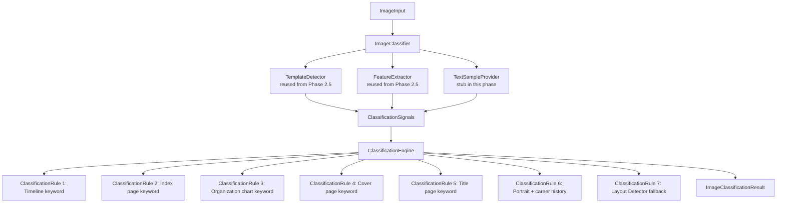
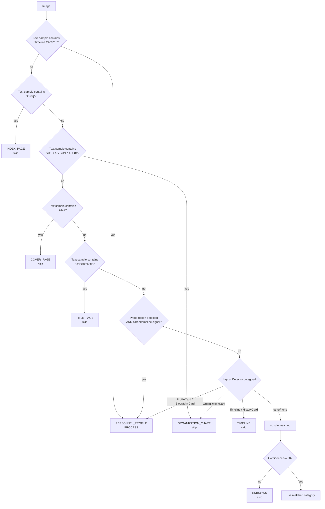

# Smart Image Classification Engine

Phase 8.5. Inserts a new stage between the Image Source and the Layout
Detector / OpenAI Vision call, deciding whether an image is worth sending
to OpenAI at all:

```
Image Source
  -> Smart Image Classification Engine   <-- new (this phase)
  -> Layout Detector
  -> OpenAI Vision
  -> Validation
  -> Normalization
  -> Career Engine
```

## Why This Exists

Real Border Patrol Police document sets contain far more than officer
profile pages — cover pages, tables of contents, organization charts,
title/insignia pages, timelines, maps, and diagrams all appear in the same
folders. Every one of those sent to OpenAI Vision is a wasted API call:
real cost, real latency, and zero usable personnel data. This engine
classifies every image into exactly one category *before* any Vision call,
and only `PERSONNEL_PROFILE` images proceed.

## Architecture



- **`classification_types.ts`** — `ImageCategory` (the 10 required
  categories), `ImageClassificationResult`, `ClassificationSignals`
  (detection + features + optional text sample — never filename/path/
  folder), and the `ClassificationRule`/`ImageClassificationEngine`
  interfaces.
- **`classification_rules.ts`** — one small class per rule (SOLID: single
  responsibility), each a pure function over `ClassificationSignals`.
  `createDefaultClassificationRules()` returns them in priority order.
- **`classification_engine.ts`** — `ClassificationEngine`: evaluates rules
  in order, takes the first match, and enforces the confidence floor
  (below 60 → `UNKNOWN`, never a guessed `PERSONNEL_PROFILE`).
- **`classification_result.ts`** — small pure helpers
  (`buildClassificationResult`, `isProcessable`) mirroring
  `lib/import/job_result.ts`'s pattern in this codebase.
- **`classification_statistics.ts`** — `DefaultClassificationStatisticsBuilder`:
  aggregates per-image results into the `logs/classification_summary.json`
  shape, including estimated savings.
- **`image_classifier.ts`** — `ImageClassifier`: the top-level entry point.
  Reuses the existing `TemplateDetector` and `FeatureExtractor` from
  Phase 2.5 (no duplicated layout-analysis logic) plus an injectable
  `TextSampleProvider` (stubbed as `NullTextSampleProvider` in this phase —
  no OCR exists yet), assembles `ClassificationSignals`, and delegates to
  `ClassificationEngine`. **No OpenAI API call is made anywhere in this
  module or anything it depends on.**

Every class is interface-first with constructor-injected dependencies
(`ClassificationEngineDependencies`, `ImageClassifierDependencies`), so
tests substitute fakes and a future phase can add a real OCR-backed
`TextSampleProvider` without touching the engine or rules.

## Decision Tree



## Classification Table

| Category | shouldProcess | Trigger (this phase's rules) |
|---|---|---|
| `PERSONNEL_PROFILE` | **true** | Text contains "Timeline รับราชการ"; OR detected photo region + timeline/career layout signal; OR Layout Detector category is `ProfileCard`/`BiographyCard` |
| `TIMELINE` | false | Layout Detector category is `Timeline` or `HistoryCard` |
| `ORGANIZATION_CHART` | false | Text contains "ระดับ บก.", "ระดับ กก.", or "ผัง"; OR Layout Detector category is `OrganizationCard` |
| `COVER_PAGE` | false | Text contains "คำนำ" |
| `TITLE_PAGE` | false | Text contains "เฉพาะตราหน่วย" |
| `INDEX_PAGE` | false | Text contains "สารบัญ" |
| `TABLE` | false | Reserved for a future rule (no current heuristic distinguishes a bare table from other layouts without real OCR/CV) |
| `MAP` | false | Reserved for a future rule |
| `DIAGRAM` | false | Reserved for a future rule |
| `UNKNOWN` | false | No rule matched, or the matched rule's confidence was below 60 |

Only `PERSONNEL_PROFILE` ever has `shouldProcess = true` — enforced
structurally by `classification_result.ts`'s `buildClassificationResult`
deriving `shouldProcess` from the category itself, so a rule cannot set
them inconsistently.

## Classification Rules — What They Never Use

Per the requirement that classification must never depend on filename,
folder name, or image path: `ClassificationSignals` (the sole input to
every rule) contains only `detection` (Layout Detector output), `features`
(visual layout features), and an optional `textSample` — there is no field
for filename/path/folder anywhere in the type, so no rule can read one even
by mistake. This is verified by a dedicated test asserting those fields are
structurally absent from `ClassificationSignals`.

## Confidence Floor

Per the requirement that confidence below 60 always downgrades to
`UNKNOWN`: `ClassificationEngine` checks every matched rule's confidence
against `MIN_CLASSIFICATION_CONFIDENCE` (60) before returning it. A rule
that matches but reports low confidence is replaced with the `UNKNOWN`
result (confidence 0, `shouldProcess: false`) rather than trusted.

## No OCR Yet — TextSampleProvider

This phase has no lightweight OCR/text-extraction implementation (that
would itself cost time/money, partially undermining the goal of *avoiding*
unnecessary processing). `NullTextSampleProvider` always returns
`undefined`, meaning only the layout/feature-based rules (`PortraitWith
CareerHistoryRule`, `LayoutDetectionFallbackRule`) can fire until a future
phase introduces a real, cheap text-sample source — a fast local OCR pass
distinct from the OpenAI Vision extraction call itself. The keyword rules
(`TimelineKeywordRule`, `IndexPageKeywordRule`, etc.) are fully implemented
and tested against synthetic text samples now, ready to activate the moment
a real `TextSampleProvider` is wired in — no changes needed to the rules or
engine.

## Cost Saving Example

Given 21 images where 6 are `PERSONNEL_PROFILE` and 15 are non-personnel
(timelines, organization charts, cover pages, etc.), with default
assumptions of $0.01 and 6 seconds per OpenAI Vision call:

```json
{
  "total_images": 21,
  "processed_images": 6,
  "skipped_images": 15,
  "estimated_api_calls_saved": 15,
  "estimated_cost_saved_usd": 0.15,
  "estimated_processing_time_saved_seconds": 90
}
```

`SavingsAssumptions` (`estimatedCostPerCallUsd`,
`estimatedProcessingSecondsPerCall`) are constructor-injectable into
`DefaultClassificationStatisticsBuilder`, so these figures can be tuned to
match observed real costs (see `docs/VISION_COSTS.md`) rather than being
hardcoded.

## Batch Import Integration

`scripts/run_batch_import.ts` runs `ImageClassifier.classify()` for every
discovered image **before** calling `processPersonnelImage()` (which is
where the OpenAI Vision call happens). If `shouldProcess` is false:
- OpenAI is never called for that image.
- A marker file (`exports/<region>/<name>.skipped.json`) is written,
  recording the classification result — this is what resume support
  checks (see below).
- The skip is appended to `logs/skipped.json` with `reason: "classification"`
  plus the `category`/`confidence` that caused it.
- `logs/classification_summary.json` is updated via
  `DefaultClassificationStatisticsBuilder`.

If `shouldProcess` is true, processing proceeds exactly as before
(Layout Detector re-runs inside `processPersonnelImage` — the classifier's
own `TemplateDetector` call and that one are independent instances in this
phase, both cheap/local and not deduplicated across the two stages, since
no OpenAI cost is involved in either).

## Resume Support

Per the requirement that a classifier-skipped image is never retried
unless a future `--force` flag is supplied: the batch runner checks for
the `.skipped.json` marker file before invoking the classifier again on a
subsequent run, exactly the same way it already checks for the real
output file to skip already-processed images. No `--force` flag exists
yet — this phase only establishes the marker-file mechanism a future
flag would need to override.

## Future Google Drive Integration

Classification signals (`TemplateDetector`, `FeatureExtractor`) are already
`ImageInput`-based (`{ source, hash?, width?, height? }`), the same
provider-agnostic shape used throughout the Layout Intelligence Engine
(Phase 2.5) and the Google Drive Scanner architecture (Phase 4). When a
future `GoogleDriveImageSource` (Phase 9B) replaces `FilesystemImageSource`
in `run_batch_import.ts`, `ImageClassifier.classify()` requires no changes
— it already only depends on `ImageInput`, not on any filesystem-specific
detail. A real OCR-backed `TextSampleProvider` could similarly be backed by
downloaded Drive file content without touching `ClassificationEngine` or
any rule.

## What This Phase Does Not Do

- No OpenAI Vision calls anywhere in the classifier or its dependencies.
- No real OCR/CV — `TextSampleProvider` is stubbed; `FeatureExtractor`
  remains the Phase 2.5 stub.
- No Google Drive SDK, no Supabase, no database, no UI.
- No `--force` flag implementation (the marker-file mechanism it would
  need is in place; the flag itself is future work).
