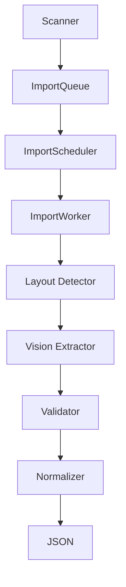

# Import Orchestrator

Phase 3. Describes the orchestration layer that scales personnel image
import to tens of thousands of images. Design and TypeScript skeleton only —
no Google Drive SDK, no real Vision API, no database, no API, no UI.

## Why This Exists

Phase 2 built a single-image Vision extractor; Phase 2.5 built layout
detection for a single image. Neither addresses running those steps across
tens of thousands of images reliably: ordering, retries, concurrency,
progress visibility, and metrics. The Import Orchestrator is that layer.

## Pipeline



- **Scanner** — not implemented in this phase (no Google Drive SDK). A
  future scanner produces `ScannedImage[]` (filename, hash, source), which
  is exactly what `BatchProcessor.enqueueAll`/`processAll` already accept.
- **ImportQueue** (`import_queue.ts`) — priority-bucketed FIFO queue of
  `ImportJob`s awaiting processing.
- **ImportScheduler** (`import_scheduler.ts`) — pulls jobs from the queue
  and drives an `ImportWorker`, either one job (`runNext`) or a full batch
  (`runBatch`) at a time.
- **ImportWorker** (`import_worker.ts`) — processes exactly one job through
  the `ImportPipeline`, emits lifecycle events, measures duration, and
  applies retry policy on failure.
- **ImportPipeline** (`import_pipeline.ts`) — runs the stage sequence for a
  single job: Layout Detector (Phase 2.5's `TemplateDetector`) -> Vision
  Extractor (Phase 2's `extractPersonnelFromImage`) -> Validator (already
  run inside the vision extractor) -> Normalizer (identity by default) ->
  final JSON (`PersonnelExtraction`).
- **BatchProcessor** (`batch_processor.ts`) — converts a large set of
  scanned images into jobs, enqueues them, and drains the queue through
  repeated scheduler batches so tens of thousands of images can be
  processed without holding them all as in-flight work simultaneously.

## ImportJob

```ts
interface ImportJob {
  id: string;
  filename: string;
  hash: string;
  status: ImportJobStatus;
  priority: ImportJobPriority; // "low" | "normal" | "high" | "urgent"
  created_at: string;
  started_at?: string;
  finished_at?: string;
  retry_count: number;
  template?: string;
  confidence?: number;
  last_error?: string;
}
```

See `types/import.ts` for the full type and `docs/IMPORT_STATE_MACHINE.md`
for the `status` state machine.

## Queue

`ImportQueue` (`import_queue.ts`) implements `ImportQueueStore`:
`enqueue`, `dequeue`, `peek`, `cancel`, `retry`, `clear`, `size`. Jobs are
held in four priority buckets (`urgent`, `high`, `normal`, `low`); `dequeue`
and `peek` scan buckets in priority order and return the oldest job (FIFO)
within the highest non-empty bucket. This keeps enqueue/dequeue O(1) rather
than re-sorting on every call, which matters at tens-of-thousands-of-jobs
scale.

## Scheduler

`ImportScheduler` (`import_scheduler.ts`) supports:
- **FIFO/priority dispatch** — via the queue's own ordering.
- **Batch scheduling** — `runBatch(batchId, size)` processes up to `size`
  jobs and emits a single `BatchCompleted` event with the aggregate result.
- **Future concurrency** — `ImportSchedulerConfig.maxConcurrency` is already
  part of the config surface; this phase runs batches sequentially
  (concurrency effectively 1), but raising it later to dispatch multiple
  jobs to a worker pool concurrently is an additive change scoped entirely
  inside `runBatch`.

## Worker

`ImportWorker` (`import_worker.ts`) processes one `ImportJob` against one
`ImageInput`:
1. Emits `JobStarted`.
2. Runs `ImportPipeline.run(job, image)`.
3. Measures duration.
4. On success: updates state, emits `JobCompleted`.
5. On failure: updates state; if `retry_count` is under the configured max,
   transitions the job to `Retrying` and emits `JobRetry`; otherwise emits
   `JobFailed`.

Because a worker only depends on injected interfaces (`ImportPipeline`,
`ImportEventEmitter`, `ImportStateStore`), running many workers concurrently
later requires no changes to this class.

## Metrics

`InMemoryImportMetrics` (`import_metrics.ts`) subscribes to `JobCompleted`
and `JobFailed` events and tracks:
- **Images processed** — count of completed jobs.
- **Average duration** — mean `durationMs` across completed jobs.
- **Validation failures** — count of failed jobs.
- **Template distribution** — count of completed jobs per detected
  `template_id`.
- **Average confidence** — mean `confidence` across completed jobs.

`snapshot()` returns an `ImportMetricsSnapshot`; `reset()` clears all
counters (useful for per-batch or per-run reporting in a future phase).

## Events

`ImportEvent` (`import_events.ts`) is a discriminated union:
`JobQueued`, `JobStarted`, `JobCompleted`, `JobFailed`, `JobRetry`,
`BatchCompleted`. `InMemoryImportEventEmitter` is a minimal typed pub/sub
bus — every module that needs to react to pipeline activity (metrics today;
logging, UI, or persistence in a future phase) subscribes to it rather than
being wired directly into the worker/scheduler.

## Dependency Injection

Every stage/module exposes an interface (`LayoutDetectorStage`,
`VisionExtractorStage`, `NormalizerStage`, `ImportQueueStore`,
`ImportWorkerEngine`, `ImportEventEmitter`, `ImportStateStore`,
`ImportMetricsCollector`) with an in-memory/default implementation.
Constructors accept dependencies via an options object with sensible
defaults, so:
- Tests can substitute fakes for any stage.
- A later phase can swap `MockVisionProvider` for a real Vision API client,
  or back `ImportStateStore`/`ImportQueueStore` with a persisted store,
  without touching orchestration code.

## Future Extension Points

- **Real Scanner** — implement Google Drive folder scanning producing
  `ScannedImage[]`, feeding directly into `BatchProcessor`.
- **Real Vision Provider** — implement `VisionProvider` (already defined in
  `lib/ai/vision_extractor.ts`) against a real Vision API.
- **Concurrent workers** — raise `ImportSchedulerConfig.maxConcurrency` and
  dispatch to a worker pool inside `runBatch`.
- **Persisted queue/state/cache** — back `ImportQueueStore`,
  `ImportStateStore`, and the Phase 2.5 `TemplateCacheStore`/
  `LayoutRegistryStore` with Supabase or another store in a later phase.
- **Richer normalization** — replace `IdentityNormalizer` with real
  trimming/casing/phone-formatting logic.
