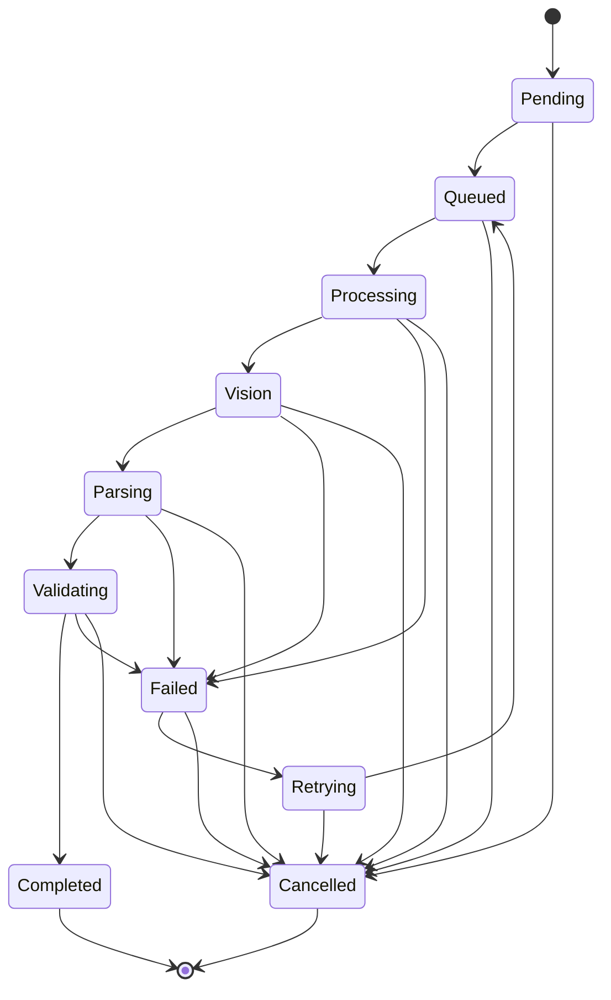

# Import Job State Machine

Describes the `ImportJobStatus` lifecycle enforced by
`lib/import/import_job.ts` (`canTransition` / `transitionJob`).

## States

- **Pending** — job created, not yet queued.
- **Queued** — waiting in `ImportQueue` for a worker.
- **Processing** — worker has picked up the job; layout detection running.
- **Vision** — Vision extraction running.
- **Parsing** — normalization running.
- **Validating** — validation check running.
- **Completed** — terminal success state.
- **Failed** — terminal (unless retried) failure state.
- **Retrying** — failed job scheduled to re-enter the queue.
- **Cancelled** — terminal state; job removed from processing intentionally.

## Diagram

## Notes

- `transitionJob` throws on any transition not listed above — this is
  intentional: an illegal transition indicates a pipeline bug (e.g. skipping
  a stage), and should fail loudly rather than silently corrupt job state.
- `Failed -> Retrying -> Queued` is the retry loop. `ImportWorker` enforces
  a `maxRetries` ceiling; once exceeded, the job is left in `Failed` and a
  `JobFailed` event is emitted instead of `JobRetry`.
- `Cancelled` is reachable from every non-terminal state, reflecting that a
  job can be cancelled at any point before it completes.
- `finished_at` is set on entering any terminal state (`Completed`,
  `Failed`, `Cancelled`); `started_at` is set on entering `Processing`.
