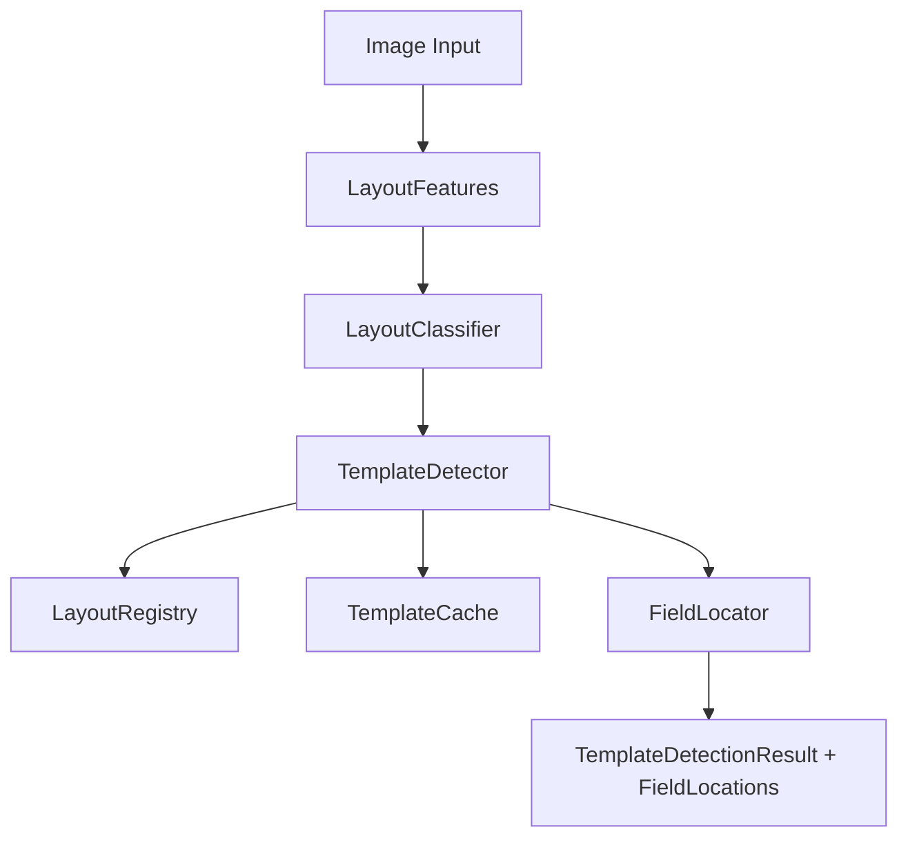

# Layout Intelligence Engine

Phase 2.5. Describes the layer that identifies a personnel image's visual
layout **before** AI Vision extraction runs. This is a design and TypeScript
skeleton only — no OCR, no external computer-vision libraries, no Supabase,
no UI, no database, no APIs.

## Why This Exists

Personnel images arrive from four Border Patrol regions, each using many
different templates (timeline layouts, profile cards, history cards, etc.).
Running AI Vision extraction blind — with no idea where the photo, name, or
timeline sit on the page — wastes prompt budget and produces inconsistent
results across templates. The Layout Intelligence Engine identifies the
template first, so the extraction step (Phase 2's `lib/ai`) can be given
tighter, template-aware guidance in a later phase.

## Architecture

- **layout_types.ts** — shared interfaces and types used across every module.
- **layout_features.ts** — extracts descriptive visual signals (header
  position, photo size, text density, timeline orientation, background
  style, dominant regions) from an image.
- **layout_classifier.ts** — classifies the feature set into a broad
  `LayoutCategory` (Timeline, ProfileCard, SimpleCard, OrganizationCard,
  HistoryCard, BiographyCard, MixedLayout, Unknown).
- **template_detector.ts** — orchestrates the full pipeline: features ->
  classification -> template resolution against the registry -> caching.
  Produces the final `TemplateDetectionResult`.
- **field_locator.ts** — estimates normalized (0-1) bounding boxes for each
  extractable field (photo, rank, name, position, phone, timeline,
  biography, header, footer), using a matched template's known layout as a
  prior when available.
- **template_cache.ts** — caches detection results by image hash so
  repeated/duplicate images skip re-running the pipeline.
- **layout_registry.ts** — maintains the set of known templates: IDs,
  aliases, versions, usage counts, and last-detected timestamps.

## Detection Flow

1. `TemplateDetector.detect(image)` computes an image hash and checks
   `TemplateCache` first.
2. On a cache miss, `LayoutFeatures` extracts a `LayoutFeatureSet` describing
   the image's visual structure.
3. `LayoutClassifier` scores every `LayoutCategory` against those features
   and returns the best match plus runner-up candidates.
4. `TemplateDetector` resolves a specific `template_id`/`version` within that
   category by consulting `LayoutRegistry` (currently: highest usage count
   in the category; see "Future Extensions" below for planned refinement).
5. The resulting `TemplateDetectionResult` is cached and the registry's
   usage count / last-detected timestamp for that template is updated.
6. `FieldLocator` can then be called with the detection result to estimate
   where each field lives on the page, using the template's registered
   `expectedFields` as a prior when known.

## Classification

`LayoutClassifier` (via `HeuristicLayoutClassifier`) scores every category
using simple, explicit rules against the extracted `LayoutFeatureSet` (e.g.
a detected timeline orientation strongly favors the `Timeline` category).
This keeps classification fully deterministic and inspectable during the
prototype phase. The `LayoutClassifierEngine` interface is designed so a
trained model can be substituted later without touching any caller.

## Feature Extraction

`LayoutFeatures` currently ships a `StubFeatureExtractor` returning a neutral
feature set — there is no real image analysis yet. The `FeatureExtractor`
interface is the seam where a later phase plugs in real computer-vision
logic (e.g. edge/region detection, text density estimation) without
changing the classifier, detector, or field locator.

## Field Localization

`FieldLocator` estimates normalized bounding boxes (`{ x, y, w, h }`, all in
`0-1`) for each field. When the detected template has `expectedFields`
registered, those are used directly as the strongest available prior.
Otherwise, `HeuristicFieldLocator` falls back to coarse per-category default
regions. This keeps localization resolution-independent and ready to feed
directly into a future template-aware AI Vision prompt (e.g. "focus on the
region at x=0.12,y=0.30,w=0.20,h=0.42 for the photo").

## Caching

`TemplateCache` is in-memory only in this phase (`InMemoryTemplateCache`),
keyed by a computed image hash (`computeImageHash`, currently a stand-in
that returns the provided hash or falls back to the image source string —
real content hashing is a future extension point). Cache hits skip feature
extraction, classification, and template resolution entirely.

## Future Extension Points

- **Real feature extraction** — replace `StubFeatureExtractor` with an
  actual image-analysis backend.
- **Trained classification** — replace `HeuristicLayoutClassifier` with a
  learned model behind the same `LayoutClassifierEngine` interface.
- **Template resolution refinement** — match against each template's
  `expectedFields`/visual signature instead of picking by usage count.
- **Persistence** — back `LayoutRegistryStore` and `TemplateCacheStore` with
  a real store (Supabase or otherwise) in a later phase; both are designed
  as interfaces specifically so this swap requires no caller changes.
- **Per-region priors** — the four Border Patrol regions may favor
  different template families; a future phase could bias detection using a
  region hint passed alongside the image.
- **Real content hashing** — replace the placeholder `computeImageHash` with
  a true content hash (e.g. SHA-256 of image bytes).
