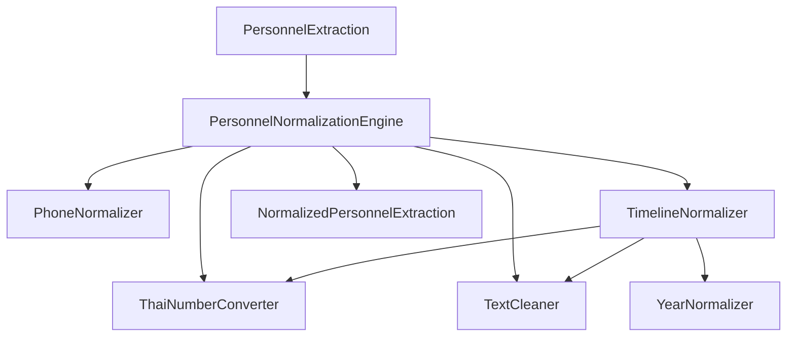

# Normalization Engine

Phase 7.5. A new stage inserted strictly between Validation and the Career
Engine, mandatory for every image processed:

```
Image
  -> Layout Detector
  -> Vision AI
  -> JSON Parser
  -> Validation
  -> Normalization Engine   <-- new (this phase)
  -> Career Engine
  -> Review
  -> Export
```

Real Border Patrol Police source documents mix Thai and Arabic numerals,
inconsistent whitespace, multiple dash characters, duplicated punctuation,
and varied phone number formatting. This layer normalizes every extracted
field into one consistent format *after* validation confirms the record is
usable, and *before* the Career Engine derives career years/units/timeline
counts from it — so career derivation always operates on clean, comparable
values (e.g. a bare numeral year, not a mixed Thai/Arabic string).

## Architecture



- **`normalization_types.ts`** — `NormalizedPersonnelExtraction`,
  `NormalizedTimelineEntry` (adds optional `display_year`), and the
  `FieldNormalizer<TInput, TOutput>` / `NormalizationEngine` interfaces
  every stage implements.
- **`thai_number_converter.ts`** — Rule 1: Thai numeral (๐-๙) to Arabic
  numeral (0-9) conversion, applied to every string field.
- **`text_cleaner.ts`** — Rules 2-4: whitespace cleanup (trim, collapse
  multiple spaces, collapse duplicate blank lines), dash normalization
  (–/—/− → -), and duplicated/mixed punctuation cleanup.
- **`phone_normalizer.ts`** — Rule 5: reformats a 10-digit Thai mobile
  number into `XXX-XXX-XXXX`, regardless of source separator style.
- **`year_normalizer.ts`** — Rule 6: extracts a bare numeral `year` from a
  Buddhist-era-prefixed value (e.g. `พ.ศ.2567` → `year: "2567"`), keeping
  the original cleaned form as `display_year`.
- **`timeline_normalizer.ts`** — composes the above per timeline entry,
  then applies Rule 7 (sort newest → oldest) and Rule 8 (remove exact
  duplicate rows) and Rule 9 (unit cleanup — whitespace only, never
  invented).
- **`normalization_engine.ts`** — `PersonnelNormalizationEngine`: the
  top-level orchestrator, composing all of the above via constructor
  injection. This is the only class other code should depend on.

Every stage is interface-first (`ThaiNumberConverterEngine`,
`TextCleanerEngine`, `PhoneNormalizerEngine`, `YearNormalizerEngine`,
`TimelineNormalizerEngine`, `NormalizationEngine`) with a single default
implementation, injected via constructor options — consistent with the
rest of this codebase's SOLID/dependency-injection conventions (see
`docs/PROJECT_RULES.md`).

## Rule 10: Never Hallucinate

Every stage treats a missing/blank/unparsable value as *itself* the
correct output — nothing is guessed. Concretely:
- `TextCleaner`/`ThaiNumberConverter` on an empty string return an empty
  string.
- `PhoneNormalizer` only reformats a value that is *exactly* 10 digits
  after separators are stripped; anything else (a landline number, a
  malformed OCR read, an empty string) passes through unchanged rather than
  being forced into the mobile-number shape.
- `YearNormalizer` only extracts a numeral when the input matches a
  recognized "พ.ศ. + 4 digits" or bare 4-digit pattern; a value like
  "ปัจจุบัน" (present) is left as-is.
- `TimelineNormalizer`'s unit cleanup trims whitespace but never invents a
  unit that wasn't extracted — `""`/`null`/`undefined` all pass through
  as-is (matching Phase 7.1's validation rule that a missing `unit` is a
  warning, not an error).

## Rule 11: Purity

Every normalizer is a pure function: given an input object/string, it
returns a new output, never mutating its argument. This is verified by
dedicated tests (`normalization_engine.test.ts`,
`timeline_normalizer.test.ts`) that snapshot the input before calling
`normalize()` and assert it is unchanged afterward.

## Timeline Ordering and Deduplication

`TimelineNormalizer.normalize`:
1. Cleans each entry's `year`/`position`/`unit` (Thai numerals + text
   cleanup), and derives `year`/`display_year` via `YearNormalizer`.
2. Removes exact duplicate rows — entries whose `year`, `position`, and
   `unit` are all identical after cleaning.
3. Sorts newest → oldest. Numeric years sort by value; entries whose year
   contains a "present" marker (`ปัจจุบัน`/"present"/"current") sort first
   (most recent); anything else sorts last, after all dated entries.

## Integration

Both `scripts/run_real_import.ts` and `scripts/run_batch_import.ts` call
`lib/import/personnel_image_processor.ts`'s `processPersonnelImage()` — the
single shared pipeline function introduced in Phase 9A. The Normalization
Engine is wired in **exactly once**, inside that shared function:

```ts
const { data: originalExtraction, validation } = await extractPersonnelFromImage(dataUri, provider);

// Phase 7.5: Validation -> Normalization Engine -> Career Engine
const normalizedExtraction = normalizationEngine.normalize(originalExtraction);

const careerIntelligence = careerEngine.analyze(normalizedExtraction);
```

Neither script contains any Normalization Engine logic directly — both
inherit the new stage automatically through the shared processor, with no
duplicated code.

## Before / After Examples

| Field | Before | After |
|---|---|---|
| Year | `พ.ศ.๒๕๖๗` | `2567` (`display_year: "พ.ศ.2567"`) |
| Bare year | `๒๕๖๔` | `2564` |
| Phone (Thai numerals, dashes) | `๐๘๒-๗๕๔-๘๒๔๔` | `082-754-8244` |
| Phone (no separators) | `0827548244` | `082-754-8244` |
| Phone (spaces) | `082 754 8244` | `082-754-8244` |
| Sentence with numerals | `ปี ๒๕๕๘` | `ปี 2558` |
| Name with extra spaces | `  John   Doe  ` | `John Doe` |
| Dash variant | `2018 – 2020` | `2018 - 2020` |
| Duplicated punctuation | `Note.. Extra,,  text` | `Note. Extra, text` |
| Timeline order | `[2018, 2022, 2020]` | `[2022, 2020, 2018]` |
| Duplicate timeline row | two identical `{year, position, unit}` entries | one entry |
| Missing unit | `""` / `null` | unchanged (never invented) |

## What This Phase Does Not Do

- No Google Drive integration (that is Phase 9B).
- No Supabase or database writes.
- No UI.
- No changes to Validation, Vision Provider, Prompt Builder, Response
  Parser, or Career Engine logic — this phase only inserts a new stage
  between Validation and the Career Engine.
