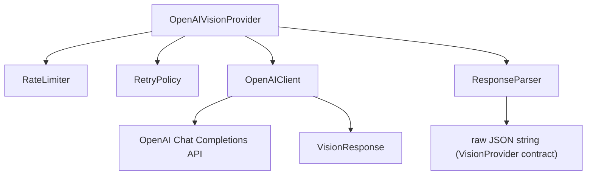

# OpenAI Vision Adapter

Phase 5. Replaces the Phase 2 `MockVisionProvider` with a production
`OpenAIVisionProvider` that satisfies the same `VisionProvider` interface,
so nothing downstream (`extractPersonnelFromImage`, Phase 3's
`ImportPipeline`/`ImportWorker`) needs to change.

## Environment Variables

| Variable | Required | Default | Purpose |
|---|---|---|---|
| `OPENAI_API_KEY` | Yes | none | OpenAI API key. Never hardcoded; read from the environment at provider construction time. |
| `OPENAI_MODEL` | No | `gpt-5.5` | Vision-capable model name. Override to point at a different model/version. |
| `OPENAI_TIMEOUT_MS` | No | `60000` | Request timeout in milliseconds. See "Timeout Configuration and Diagnostics" below before raising this. |

Add these to `.env.local` (gitignored); `.env.example` documents all three
variables with no real values.

## Architecture



- **openai_provider.ts** — `OpenAIVisionProvider implements VisionProvider`.
  Acquires a rate-limit slot, runs the client call through the retry
  policy, validates the response is bare parsable JSON, and returns the
  raw JSON string — exactly what `MockVisionProvider.extract` already
  returned. `createOpenAIVisionProviderFromEnv` builds one from
  `OPENAI_API_KEY`/`OPENAI_MODEL`.
- **openai_client.ts** — `OpenAIClient` interface + `HttpOpenAIClient`, a
  `fetch`-based Chat Completions caller (no `openai` SDK dependency added).
  Translates `VisionRequest` to the API's wire format and back to a
  provider-agnostic `VisionResponse`.
- **vision_request.ts** / **vision_response.ts** — provider-agnostic
  request (image, prompt, temperature, max output tokens) and response
  (content, usage, model) shapes, decoupled from the OpenAI wire format.
- **response_parser.ts** — `StrictJsonResponseParser`: rejects markdown
  code fences and any non-JSON wrapping text; the entire trimmed response
  must parse as a single JSON object.
- **retry_policy.ts** — `ExponentialBackoffRetryPolicy` + `withRetry`:
  retries on HTTP 429/500/502/503/504 with exponential backoff (respecting
  a server `Retry-After` value for 429s), gives up after `maxRetries`.
- **rate_limiter.ts** — `InProcessRateLimiter`: sliding-window
  requests-per-minute limit plus a concurrency semaphore, so a large batch
  import can't burst past provider limits.
- **cost_estimator.ts** / **token_estimator.ts** — see
  `docs/VISION_COSTS.md`.
- **vision_errors.ts** — typed errors: `VisionTimeout`, `VisionRateLimit`,
  `VisionParseError`, `VisionValidationError` (plus `VisionProviderError`
  for other non-2xx responses).

## Compatibility with Phase 2

`OpenAIVisionProvider.extract(imagePath, prompt): Promise<string>` matches
`VisionProvider` from `lib/ai/vision_extractor.ts` exactly. Swapping
providers is a one-line change at the call site:

```ts
// Phase 2 (mock)
const result = await extractPersonnelFromImage(imagePath, new MockVisionProvider());

// Phase 5 (real)
const provider = createOpenAIVisionProviderFromEnv();
const result = await extractPersonnelFromImage(imagePath, provider);
```

`extractPersonnelFromImage`'s own JSON parsing, field validation
(`json_validator.ts`), and confidence scoring (`confidence_score.ts`) are
unchanged — `OpenAIVisionProvider` only replaces where the raw JSON string
comes from.

## Vision Request Parameters

`buildVisionRequest(imagePath, prompt, options)` (`vision_request.ts`)
applies defaults for any parameter not explicitly set:

| Field | Default | Notes |
|---|---|---|
| `temperature` | `0.1` | Low, favors consistent/deterministic extraction over creative variation. |
| `reasoningBudget` | `{ reasoningTokens: 2048, outputTokens: 2048 }` (4096 total) | See "Reasoning Budget" below. |

Both are overridable via `OpenAIVisionProviderDependencies.requestOptions`.

`HttpOpenAIClient` sends the combined reasoning budget to the Chat
Completions API as `max_completion_tokens` (not the deprecated
`max_tokens`, which current OpenAI models reject with an
`unsupported_parameter` error).

### Reasoning Budget

Reasoning-capable models (`gpt-5.5`, `o1`, `o3`, ...) spend completion
tokens on internal reasoning *before* producing any visible output text.
If the total token budget is too small, the model can exhaust it entirely
on reasoning and return `finish_reason: "length"` with an **empty**
`message.content` — visible completion_tokens will equal reasoning_tokens,
with nothing left over for output.

`lib/ai/reasoning_budget.ts` models this as a `ReasoningBudget` with
independently configurable `reasoningTokens` and `outputTokens`, combined
into the single `max_completion_tokens` value the Chat Completions API
accepts (there is no separate reasoning-budget request parameter on this
API today; a future API/model that exposes one can be supported without
changing any caller of this module):

```ts
buildVisionRequest(imagePath, prompt, {
  reasoningBudget: { reasoningTokens: 3000, outputTokens: 1500 }, // 4500 total
});
```

Defaults to 2048 reasoning + 2048 output = **4096 total**, replacing the
old flat default of 1024, which left no room for reasoning-heavy models to
produce visible output.

**Backwards compatibility:** the legacy `VisionRequestOptions.maxOutputTokens`
field still works — it is treated as the total completion budget and split
using the default reasoning/output ratio. If a legacy value smaller than
4096 is supplied, the new 4096 default is used instead, so pre-existing
small values don't reintroduce the truncation bug this fix addresses.

`HttpOpenAIClient` logs `finish_reason`, `completion_tokens`,
`reasoning_tokens`, and the derived visible `output_tokens` for every
response. If `finish_reason === "length"`, it throws a dedicated
`VisionTokenLimitError` (not a `VisionParseError`/`VisionValidationError`)
carrying `completionTokens`/`reasoningTokens` and a message recommending a
larger token budget — this is thrown *before* any JSON-shape validation,
so a truncated response is never mistaken for a malformed one.

**Temperature is model-dependent.** Some models (`gpt-5.5`, other `gpt-5*`
models, and the `o1`/`o3` reasoning model families) only support the
default `temperature` value and reject any explicit value with an
`unsupported_value` error. `HttpOpenAIClient` checks the configured model
against `modelSupportsTemperature()` and omits `temperature` from the
request body entirely for those models; `VisionRequest.temperature` is
still populated internally (used by cost/token estimation) but is only
sent over the wire for models that accept it (e.g. `gpt-4o`). See
`FIXED_TEMPERATURE_MODEL_PREFIXES` in `openai_client.ts` to update the list
as model support changes.

## Response Parsing Rules

`StrictJsonResponseParser` tolerates common real-world wrapping (bare JSON,
markdown-fenced JSON, leading/trailing prose) and extracts the first valid
JSON object found; see `lib/ai/response_parser.ts` for the full extraction
strategy. It only rejects a response when no valid JSON object can be
found at all.

Any such rejection throws `VisionParseError` with the offending raw content
attached, which `OpenAIVisionProvider` wraps as `VisionValidationError`
before it leaves `extract()` — so callers relying on `VisionProvider`'s
contract see a clear, typed failure rather than a downstream JSON.parse
crash inside `extractPersonnelFromImage`.

## Retry Policy

Retries apply only to these status codes: `429`, `500`, `502`, `503`,
`504`. Delay is `baseDelayMs * 2^attempt`, capped at `maxDelayMs`; a 429's
`Retry-After` header (if present) overrides the computed delay. Default:
3 retries, 500ms base delay, 8s cap. All non-retryable errors (e.g. 400,
401) propagate immediately without retry.

## Timeout Configuration and Diagnostics

Default timeout: **60 seconds** (`OPENAI_TIMEOUT_MS`, default 60000),
raised from an original 30s default that could time out legitimately slow
reasoning-model requests, not just genuinely hung ones. The configured
timeout and its source (env var vs. default) are always logged on provider
construction — the timeout is never changed without a visible trace:

```
[createOpenAIVisionProviderFromEnv] configured timeout: 60000ms (source: default)
```

To distinguish *why* a request is slow or times out, `HttpOpenAIClient`
logs two things on every call:

**Before the request is sent** (`request diagnostics`) — prompt size,
image size, and completion budget, since an oversized prompt/image or an
unnecessarily large `reasoningBudget` can all legitimately slow a request
down independent of network or OpenAI processing time:

```
[HttpOpenAIClient] request diagnostics: {
  model: 'gpt-5.5',
  configured_timeout_ms: 60000,
  prompt_characters: 1240,
  estimated_prompt_tokens: 310,
  image_bytes: 482113,
  request_body_bytes: 643890,
  max_completion_tokens: 4096,
  reasoning_tokens_budget: 2048,
  output_tokens_budget: 2048
}
```

**After the response (or on timeout)** (`timing breakdown`) — four
timestamps (request started, request sent, first response byte, response
completed) and the derived duration of each phase, so a timeout can be
attributed to a specific phase rather than treated as an opaque failure:

```
[HttpOpenAIClient] timing breakdown: {
  request_started_at: '...', request_sent_at: '...',
  first_response_byte_at: '...', response_completed_at: '...',
  pre_request_setup_ms: 0,       // time before fetch() was even called
  waiting_for_openai_ms: 21400,  // fetch() call to headers received — OpenAI processing time
  body_transfer_ms: 40,          // headers received to full body read
  total_elapsed_ms: 21441
}
```

`waiting_for_openai_ms` is the dominant signal: if it accounts for nearly
all of `total_elapsed_ms` and the request still hits the timeout, that
points to genuine OpenAI processing time (likely reasoning-heavy, see
"Reasoning Budget" above) rather than a client or network issue — raise
`OPENAI_TIMEOUT_MS` in that case. If `pre_request_setup_ms` or
`body_transfer_ms` are unexpectedly large instead, the cause is more likely
client-side (e.g. large image encoding) or network-side, not OpenAI's
processing time.

## Rate Limiting

`InProcessRateLimiter` defaults to 60 requests/minute and 5 concurrent
requests. Both are configurable via `RateLimiterConfig`. `acquire()`
blocks (without busy-waiting — via timers) until both a time-window slot
and a concurrency slot are available; `release()` must be called after
each request (handled automatically inside `OpenAIVisionProvider.extract`
via `try/finally`).

**Future extension point:** replace `InProcessRateLimiter` with a
distributed/queue-backed limiter if the import pipeline scales across
multiple processes or machines (see `docs/IMPORT_PIPELINE.md`'s
concurrency notes) — the `RateLimiter` interface is the seam.

## Error Types

| Error | Thrown when |
|---|---|
| `VisionTimeout` | Request exceeds `OpenAIClientConfig.timeoutMs` (default 60s, configurable via `OPENAI_TIMEOUT_MS`). See "Timeout Configuration and Diagnostics" for root-causing before raising this. |
| `VisionRateLimit` | HTTP 429 response; carries `retryAfterMs` if the server provided one. |
| `VisionTokenLimitError` | `finish_reason: "length"` — response truncated before producing output, most commonly a reasoning-capable model exhausting its token budget on reasoning. Carries `completionTokens`/`reasoningTokens`; not retried (retrying with the same budget would fail identically — raise `reasoningBudget` instead). |
| `VisionParseError` | No valid JSON object can be extracted from the response at all. |
| `VisionValidationError` | Wraps a `VisionParseError` at the `OpenAIVisionProvider.extract()` boundary. |
| `VisionProviderError` | Any other non-2xx response (e.g. 400 bad request, 401 unauthorized); not retried. |

## Future Extension Points

- Swap `HttpOpenAIClient` for the official `openai` SDK, or add support for
  the Responses API / structured output mode.
- Replace `HeuristicTokenEstimator` with a real tokenizer for exact counts.
- Replace `InProcessRateLimiter` with a distributed limiter.
- Add streaming support if partial-result display becomes useful in a
  future UI phase.
