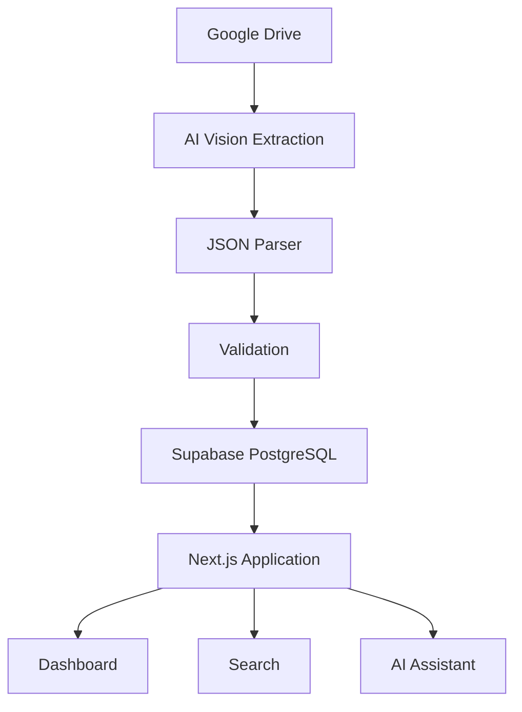
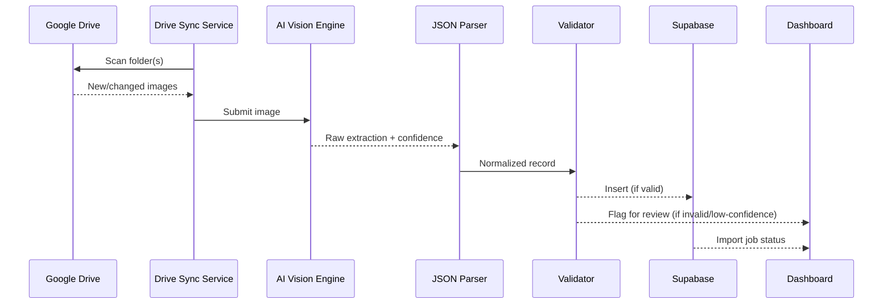

# System Architecture

## High-Level Data Flow

## Component Responsibilities

- **Google Drive** — Source of personnel profile images, organized in scanned folders.
- **AI Vision Extraction** (`lib/ai`) — Sends images to an AI vision model, returns raw structured text/JSON with a confidence score per field.
- **JSON Parser** (`lib/parser`) — Normalizes raw AI output into the internal personnel data model.
- **Validation** (`lib/parser`, `lib/types`) — Zod schema validation; low-confidence or malformed records are flagged for manual review rather than auto-imported.
- **Supabase PostgreSQL** (`lib/database`, `prisma/`) — System of record. Also hosts file storage for source images.
- **Next.js Application** (`app/`) — Server-rendered UI consuming the database via Prisma/Supabase client.
- **Dashboard** — Import job monitoring, status, and manual review queue.
- **Search** — Advanced search across personnel records.
- **AI Assistant** — Natural language querying layer over the personnel database (later phase).

## Import Pipeline (Sequential View)

## Design Principles

- Each stage is independently testable and replaceable (e.g. AI vision provider can be swapped without touching the parser).
- Every stage writes progress/errors to `import_jobs` for observability.
- No stage trusts the output of the previous stage without validation.
