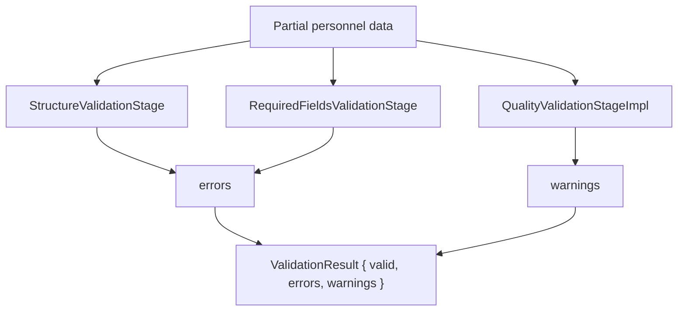

# Validation Engine

Phase 7.1. Describes the validation subsystem for AI-extracted personnel
records (`lib/ai/json_validator.ts`), consumed by `vision_extractor.ts` and
surfaced through `ValidationResult` everywhere it flows (Phase 3's
`ImportPipeline`, Phase 8's review layer, `scripts/run_real_import.ts`).

## Why This Exists

Real official Border Patrol Police personnel records routinely omit the
unit for some historical timeline positions — this is correct, honest OCR
behavior (the AI should not hallucinate a value that isn't printed on the
source card), not a defect. The original validator treated every timeline
field, including `unit`, as equally mandatory, so a perfectly accurate
extraction of an incomplete real-world record was rejected outright
(`valid: false`) and the entire image was written to `error.json` instead
of being imported. This subsystem exists to separate "this record cannot
be used at all" from "this record is usable, but here's what's missing."

## Fatal Errors vs. Warnings

| | Fatal Errors | Warnings |
|---|---|---|
| Affects `valid` | Yes — any error sets `valid: false` | No — warnings never affect `valid` |
| Meaning | The record cannot be trusted/imported as-is | The record is usable; a data-quality gap is worth surfacing |
| Examples | missing `rank`/`first_name`/`last_name`/`position`/top-level `unit`; missing/malformed `timeline`; `timeline[].year` or `timeline[].position` missing; wrong data types anywhere; malformed JSON | missing `phone`; missing `notes`; missing `timeline[].unit` |

**Every optional field (`phone`, `notes`, `timeline[].unit`) can be
missing, an empty string, or `null` without ever producing an error** —
only a warning. A *wrong type* for an optional field (e.g. `phone: 12345`
as a number, or `timeline[].unit: 42`) is still a fatal structural error,
since that indicates a genuinely malformed response rather than an honestly
blank field.

## Architecture



Three independent stages (SOLID: single responsibility per stage),
composed by `PersonnelValidator`:

1. **`validateStructure()`** (`StructureValidationStage`) — is the shape of
   the data even well-formed enough to inspect further? Checks types
   (`phone`/`notes` must be a string if present at all; `timeline[].unit`
   must be a string, `null`, or omitted — never some other type;
   `confidence` must be a number 0-100 if present; `timeline` must be an
   array, and each entry must be an object). Always fatal — no tolerance
   applies to a response that isn't shaped correctly at all.
2. **`validateRequiredFields()`** (`RequiredFieldsValidationStage`) —
   fields without which the record cannot be considered usable:
   `rank`, `first_name`, `last_name`, `position`, top-level `unit`,
   `confidence`, and per-entry `timeline[].year`/`timeline[].position`.
   Always fatal.
3. **`validateQuality()`** (`QualityValidationStageImpl`) — fields that are
   commonly and legitimately absent in real source records: `phone`,
   `notes`, and `timeline[].unit`. Never fatal; each gap produces a
   `ValidationWarning` instead.

`PersonnelValidator.validate()` runs all three stages and merges their
output into the final `ValidationResult`. Stages are constructor-injected
(`PersonnelValidatorDependencies`), so a future phase can add, remove, or
swap individual stages (e.g. a stricter structure stage for a specific
region's data) without touching the others.

## ValidationResult Shape

```ts
interface ValidationError {
  field: string;
  message: string;
}

interface ValidationWarning {
  field: string;
  message: string;
}

interface ValidationResult {
  valid: boolean;
  errors: ValidationError[];
  warnings: ValidationWarning[]; // always present, defaults to []
}
```

`warnings` is purely additive. Every existing caller that only reads
`validation.valid` or `validation.errors` (Phase 3's `ImportPipeline`,
Phase 8's review layer, `scripts/run_real_import.ts`) continues to work
unchanged — none of them needed modification for this fix.

## Backward Compatibility

`validatePersonnelExtraction(data)` — the original function signature — is
preserved and now delegates to `new PersonnelValidator().validate(data)`.
No caller needed to change its import or call site.

## Future Confidence Rules

Warnings are structured identically to errors (`{ field, message }`)
specifically so they can later feed into confidence scoring (Phase 2's
`lib/ai/confidence_score.ts`) or Phase 8's `ConfidenceReviewEngine` — e.g.
a record with many `timeline[].unit` warnings could be scored slightly
lower or flagged more prominently for human review, without ever being
rejected outright. At import-pipeline scale (10,000+ records across
multiple regions), aggregating warning counts per field across a batch is
also a natural future addition to `lib/import/import_metrics.ts`, to
surface which regions/templates produce the most incomplete-but-valid
records — no such aggregation exists yet; this is a design note for a
future phase, not a claim about current behavior.
