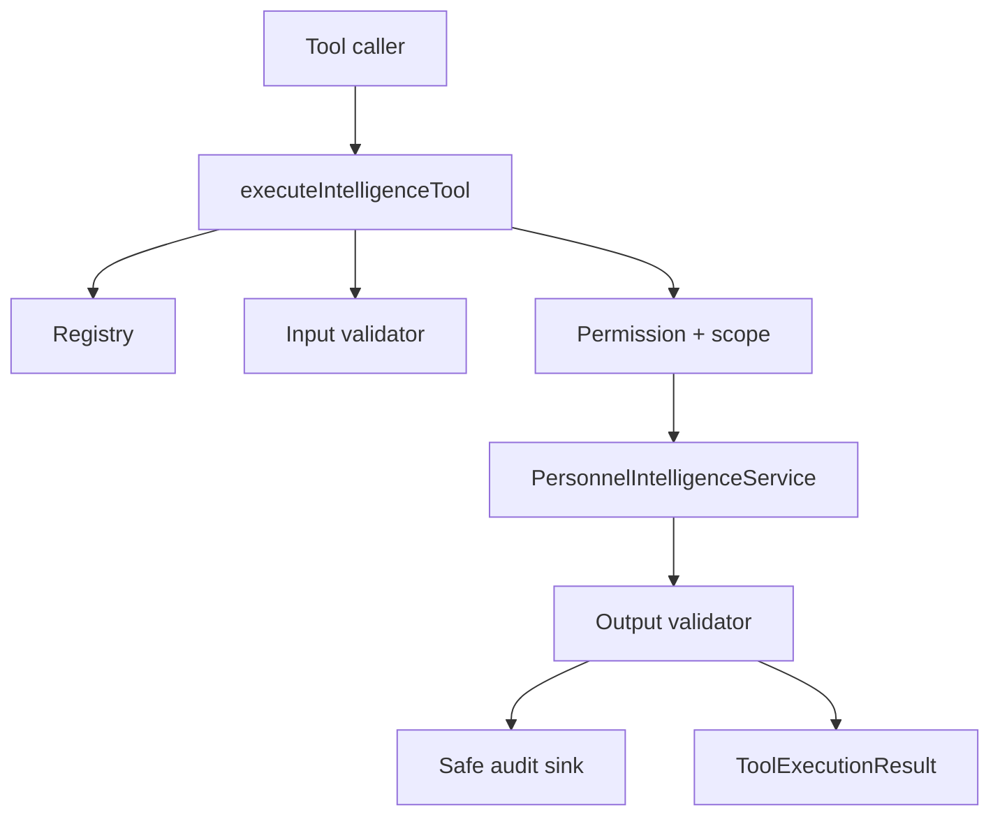

# Personnel Intelligence Tools (Phase 49.6)

## 1. Purpose

Governed **Tool Registry & Execution Framework** above the Phase 49.5
`PersonnelIntelligenceService`. Future AI Commander, bots, and automation must
call only `executeIntelligenceTool(...)`.

## 2. Layer boundaries

```
AI / Bot / Automation
        ↓
executeIntelligenceTool()
        ↓
Registry → validate → authorize → scope → PersonnelIntelligenceService
        ↓
Safe DTO + ToolExecutionResult + audit metadata
```

Future callers must **not** import Prisma, repositories, engines, report builders,
or Commander dataset loaders directly.

## 3. Registry architecture

- Immutable map built once at module init (`getIntelligenceToolRegistry()`)
- Exactly nine canonical tools
- Duplicate names fail at initialization
- No personnel data, actors, or secrets stored in the registry

## 4. Tool manifest

`getIntelligenceToolManifest()` returns serializable metadata only (no handlers).
Intended for Phase 50 model/tool registration. Not exposed via a public API in this phase.

## 5. Execution sequence

1. Establish `requestId`
2. Resolve tool definition
3. Validate actor presence
4. Validate input (unknown root keys rejected)
5. Resolve capability → authorize
6. Resolve/enforce organization scope
7. Obtain or reuse request-scoped service/context
8. Execute handler once
9. Validate/sanitize output
10. Record safe audit event
11. Return stable success/error envelope

## 6. Permission resolution

Tool capabilities map onto Phase 49.5 `IntelligenceCapability` checks
(`TOOL_CAPABILITY_TO_SERVICE`). Officer may view own intelligence only;
Commander/Admin follow existing `dashboard.view` / `commander.search` /
`officers.view` permissions.

## 7. Scope enforcement

`resolveIntelligenceToolScope` uses Phase 49.5 `assertScopeAllowed`.
**Limitation retained:** `AuthUser` has no per-region ACL yet — authorized
commanders are unrestricted; inventing fake ACL data is avoided.

## 8. Input validation

Allowlisted root keys; page ≥ 1; pageSize ≤ 100; ISO `asOf`; enum/sort validation.
No natural-language parsing.

## 9. Output validation

Reuses `FORBIDDEN_INTELLIGENCE_KEYS` from Phase 49.5. Rejects functions, `Date`
objects, circular refs, Prisma markers, and internal engine objects.
Failures return `OUTPUT_VALIDATION_FAILED` without returning unsafe data.

## 10. Audit events

Safe metadata only: request/context ids, tool name/version, actor role,
capability, scope summary, timing, success/error code, optional resultCount.
Never logs search text, officer PII, credentials, or full I/O bodies.
Default sink is a no-op; console sink is available in development.

## 11. Error model

`TOOL_NOT_FOUND` · `INVALID_TOOL_INPUT` · `UNAUTHENTICATED` · `FORBIDDEN` ·
`INVALID_SCOPE` · `OFFICER_NOT_FOUND` · `DATA_UNAVAILABLE` ·
`OUTPUT_VALIDATION_FAILED` · `TOOL_EXECUTION_FAILED` · `INTERNAL_ERROR`

## 12. Request isolation

Separate executions use separate service contexts (`contextId`). Registry holds
no user state. No global current actor/scope.

## 13. Registered tool catalog

| Name | Category | Capability |
|------|----------|------------|
| get_commander_summary | summary | intelligence.summary.view |
| search_officers | personnel_search | intelligence.officers.search |
| get_officer_intelligence | officer_detail | intelligence.officer.view |
| get_promotion_summary | promotion | intelligence.promotion.view |
| get_retirement_summary | retirement | intelligence.retirement.view |
| get_document_summary | documents | intelligence.documents.view |
| get_training_summary | training | intelligence.training.view |
| get_executive_brief | executive_brief | intelligence.brief.view |
| get_report_projection | reports | intelligence.reports.view |

All tools: `readOnly: true`, version `1.0.0`.

## 14. Example internal execution

```ts
const { service, context } = /* request-scoped bundle */;
const result = await executeIntelligenceTool({
  toolName: "get_commander_summary",
  input: { regionId: 1 },
  actor,
  service,
  serviceContext: context,
});
if (result.ok) {
  console.log(result.data.personnelTotal);
}
```

Server helper: `executeIntelligenceToolForRequest({ actor, toolName, input })`
(loads the Commander dataset once under Next.js). Deterministic harness coverage is in
`lib/personnel_intelligence_service/tools/__tests__/integration_smoke.test.ts`.

## 15. Phase 50 integration contract

Phase 50 **may**: inspect the manifest, select a registered tool, submit
structured input, call `executeIntelligenceTool()`, explain the typed result.

Phase 50 **may not**: import engines/Prisma, bypass permissions/validation/scope,
execute unregistered tools, expose raw internals, or invent tool outputs.

## 16. Explicit non-goals

No LLM provider, chatbot UI, NL parsing, autonomous planning, multi-step
workflows, mutation tools, LINE/Telegram, generic public execute API, or
WebSocket/background jobs.

## 17. Known limitations

- No generic HTTP tool endpoint (intentional — reduces attack surface)
- Organization ACL on `AuthUser` not yet modeled
- Core executor requires a trusted actor + request-scoped service/context
  (authentication stays in the server adapter)


